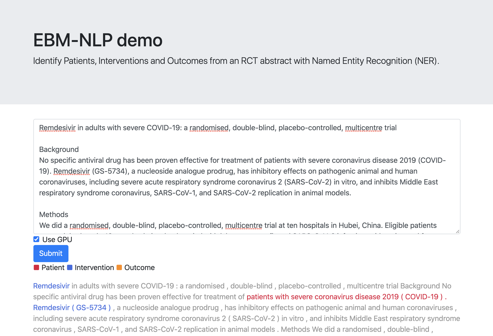

# 0. What is this?

This is a solution to the EBM-NLP task proposed in [this ACL 2018 publication](https://arxiv.org/abs/1806.04185) by Benjamin Nye et al.

The method is Named Entity Recognition (NER) with BioELMo + CRF under PyTorch implementation.

# 1. Preparation
1. Clone this repository:
```sh
$ git clone https://github.com/iBotamon/ebmnlp.git
```

2. Activate Virtual Enviroment:
```sh
$ cd ebmnlp
$ python -m venv .
$ source bin/activate
```

3. Install necessary packages:

```sh
$ pip install --upgrade pip
$ pip install -r requirements.txt
```

4. Download the following files:
- Save [Model checkpoint](https://drive.google.com/drive/folders/1cID_mPxRnq6nQ6ZmbL0S3wyGslD--JsT?usp=sharing) in `models/ebmnlp_bioelmo_crf`.
- Save [BioELMo weights](https://drive.google.com/file/d/1CHRd5YQrt3ys64WfJkJR1KX72-2CaT4I/view) in `models/bioelmo`.
- Save [BioELMo options](https://drive.google.com/file/d/19sLZ1NhUtD_bMgTstSRWoVDx6Vm-T8Qt/view) in `models/bioelmo`.
- Save [BioELMo vocabulary](https://drive.google.com/file/d/15cXEVoRhUQ9oBnHVFP3nx6GQozczgxgP/view) in `models/bioelmo`.

Instead, you can also download them by running this:
```sh
$ bash get_pretrained_models.sh
```

# 2. How to use BioELMo + CRF model
### 2-1. Use via command line
1. Prepare text file that contains an RCT abstract (e.g., sample.txt).

2. Run like this:
```sh
$ python ebmnlp.py TEXT_FILE_NAME
```

3. NER tagging result will be returned in a standard output:
```
I-I	Remdesivir
O	in
I-P	adults
I-P	with
I-P	severe
I-P	COVID-19
I-P	:
O	a
O	randomised
O	,
O	double-blind
O	,
O	placebo-controlled
O	,
O	multicentre
```

4. If you wish to get the result as a file, run like this:
```sh
$ python ebmnlp.py TEXT_FILE_NAME OUTPUT_FILE_NAME
```

### 2-2. Use via Web browser
1. Run this:
```
$ bash run_flask.sh
```

2. Access to `localhost:5000` via your Web browser.

3. You can use the PIO identification system interactively.




# 3. How to train BioELMo + CRF model yourself
1. Prepare EBM-NLP dataset `ebm_nlp_1_00.tar.gz` from [the repository by the authors](https://github.com/bepnye/EBM-NLP).

2. Extract `ebm_nlp_1_00.tar.gz` in the `official` directory like this:
```
- models
- templates
- official
  └ ebm_nlp_1_00
    └ annotations
      └ ..
    └ documents
      └ ..
```

3. Run this:
```sh
$ python ebmnlp_bioelmo_crf.py
```

You can specify CUDA device number like this:
```sh
$ python ebmnlp_bioelmo_crf.py --cuda 3
```
